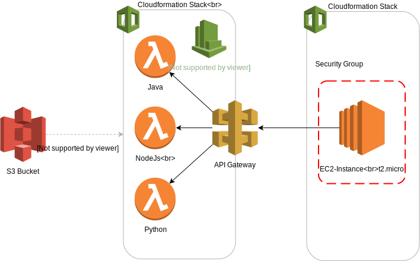

# Comparison of Lambda Runtimes for computational intensive tasks

Code Repository for the [Lambda Runtime Comparison for CPU Intensive Tasks Blog post](https://viesure.io/lambda-runtime/)

## Prerequisites
* AWS Account
* AWS CLI
* Java 8 JDK
* AWS SAM (for local)
* Docker (for local)

## How to run it
First, make sure you're all set up to use the AWS CLI from your command line.
Then run the deploy.sh script with appropriate parameters. In general a target around 2000 produces sufficient runtime. You might need higher values for your local machine.

After the script finished you'll have a result zip file in your folder, as well as a cloudwatch dashboard to see the key values of the lambda log files.

The script does not delete the lambdas and bucket, so you can still use them if you want. To get rid of everything run the cleanup.sh, HOWEVER this will delete buckets and log groups with similar names of this projects prefix, so take care not to accidentally delete anything you want to keep.

# Architecture

